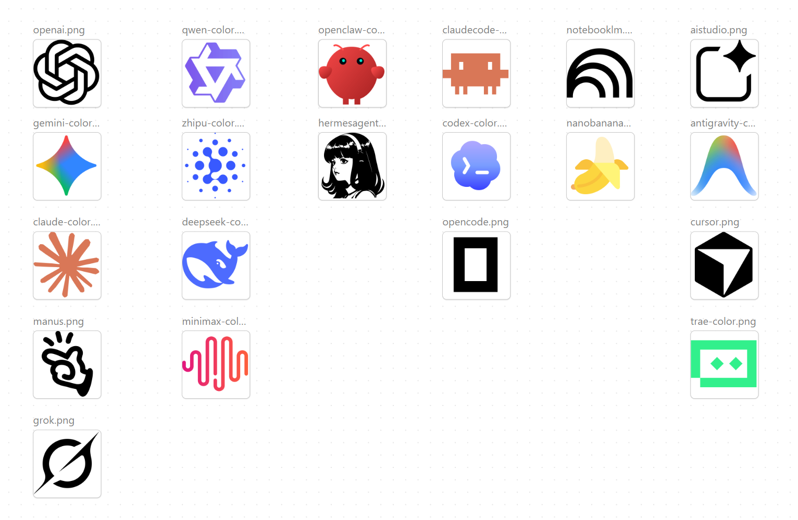
# AI工具使用的经验分享

## 前言
事实证明期末月除了复习做什么都很有意思，笔者近期想汇总一下之前所使用的ai工具，同时分享一些使用的经验，涉及到一些日常使用的场景与ai编程的部分，如果有描述不准确的地方，欢迎批评指正， **还有一个想和大家分享的一个很有意思的问题，你认为现在你所使用的这些人工智能工具是不是真正的“智能”呢**
## 正文
汇总了一下，大概较为常用的ai工具有以下的一些，国外的有chatgpt、gemini、claude、grok、manus(?)，国内的大概就是千问、deepseek、minimax、kimi、glm还有豆包，这些便是日常手机使用app与网页端常用的一些ai工具，大部分的用户都是使用豆包居多，豆包现在也满足了绝大部分的使用场景，例如翻译、搜索、生图、视频生成、ppt生成，现在甚至引入了同声传译、音乐生成等功能，但是如果你需要的是更加准确、精细化的工作，豆包就无法满足了，我想从以下几个方面去给大家介绍一些相关的ai工具。
### 资料搜集
#### 1.gemini与notebooklm
在许多的工作任务中，我们都需要去进行资料收集，例如你需要去进行一个ppt制作，或者是你需要去开展一个项目，你首先是需要去对你的研究目标去进行资料收集，但手动去搜索所花费的时间成本可能很高，可是使用ai又会有幻觉方面的担忧，在这个时候gemini就发挥了一个很重要的作用，在gemini的界面中会有一个叫做deep research的功能，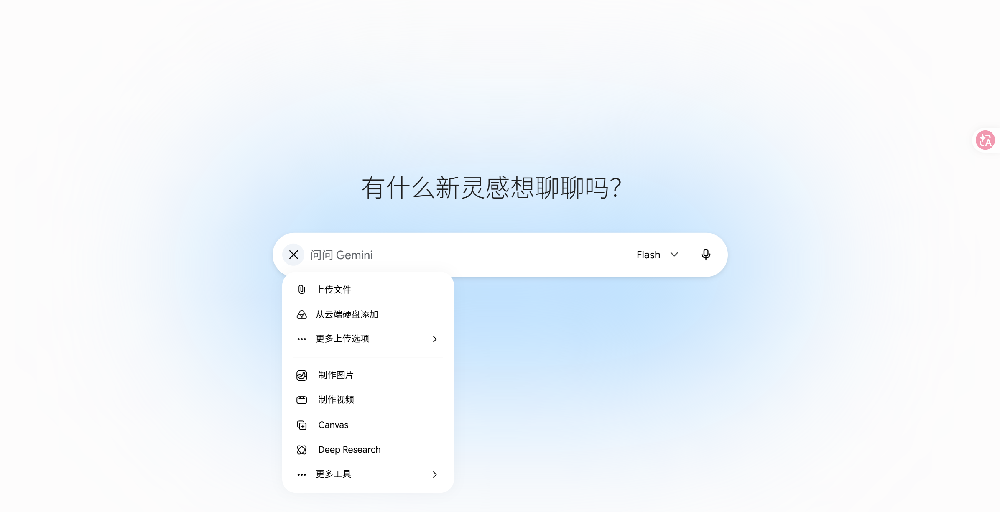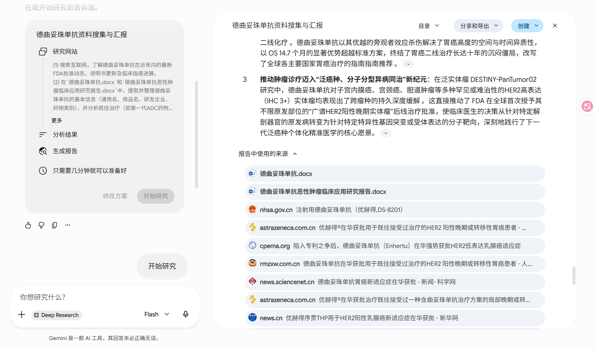这个功能搜集出来的资料都有给出网址，且网址都是真实的，并不是像你让ai给出几篇某某方向的论文，他给你一些看起来特别真实的文献但是实际一查发现查无此文，这种场景下，gemini的deep research就带给了你很大的便利。除此之外，notebooklm这个工具更加实用，同属google的生态之下，在google强大的连通之下，notebooklm和gemini一起使用也变得更加丝滑，如果你恰好有个gemini pro，那你就可以真正体验到工具带给你的极致便利
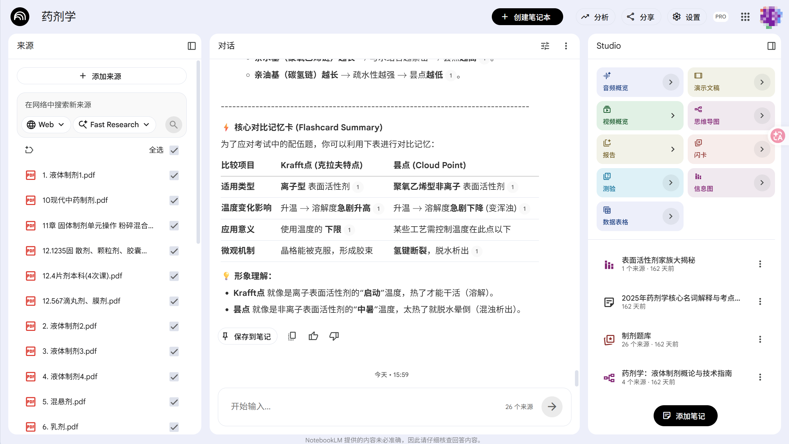对于notebooklm，这个工具则是你将搜集到的文件（例如ppt、pdf、youtube上视频的网址等）全部上传到笔记本中，可以通过提问的方式，去快速了解某一个知识，每次的回答它都会给你标注来自你上传的文件中的哪一个段落，在你写文章的时候可以达到一个快速引用的效果，其次的话，这个ai工具有图片生成（基于nanobanana）还有ppt生成，可以选择基于哪些文件来生成图片以及生成什么风格的图片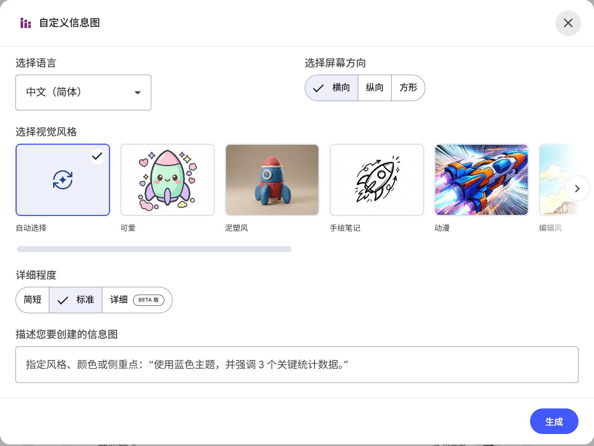
假设我输入想要用一张手绘风格的图片去介绍药剂学，那就会得到以下的图片（唯一的不足之处就是生成的中文图片会存在部分字体模糊的情况），可以看到效果是非常好的

其次notebooklm还可以制作学习指南、播客功能等，这些功能读者可以自行去探索
#### 2.claude code类cli工具（只做介绍，不做演示）
如果你有接触一些有关ai的资讯，你会听说过各种cli工具，像是claude code，codex，opencode，deepseek-tui，甚至国内的ai厂商也在不断推出新的cli工具，如glm的zcode，小米的mimocode等，读者可以选择自己喜欢的工具去进行操作，这些工具的操作逻辑是一样的，不同之处可能在于因设计架构与模型的不同而在使用体验与缓存命中率等方面而产生差异，但是由于限制问题，大部分的用户是没法使用claude等海外模型，这个时候你可以去购买国内模型的coding plan等订阅，这里比较推荐claude code+国产模型。在资料搜集方面则是依据你输入的提示词，例如，请你启用联网搜索帮我搜集一些关于某某方面的文献（资料）等等，你可以在claude code中配置一些skill来辅助你的任务。由于很多读者没有计算机的基础，所以如果后续有时间的话我会出一些这方面的使用教程。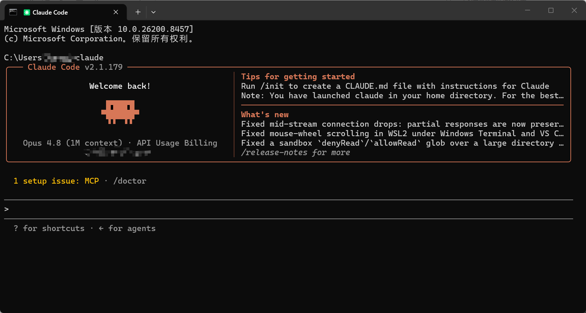
#### 3.openclaw类（只做介绍，不做演示）
在今年的一月份一直到3月底，相信大家的社交媒体都会被所谓的龙虾刷屏，什么某某岗位要被龙虾取代了之类的帖子，开始出现了一些ai焦虑的现象，不断刷到各种各样的名词，什么mcp、cli、skill、prompt engine、harness、loop engine等，有句话说得好，如果你对这些概念了解不过来，那就干脆不学了，因为他马上会被新的概念所取代，但归根结底，我们应该是去接受和利用这些ai功能，将其与我们的工作或者生活结合这才是一个向上的做法
说回龙虾，这个配置起来并不难，可以参考https://mp.weixin.qq.com/s/n15MLa2B4SZOvPbZjsaPiw这个教程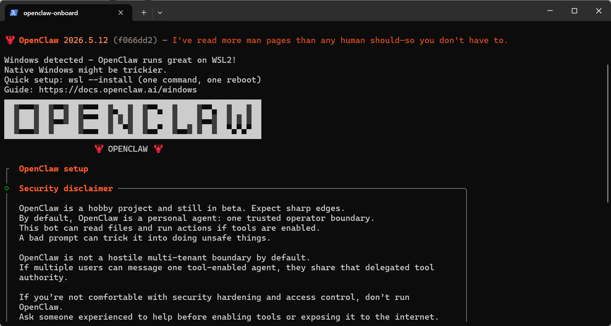
这个的好处就在于可以直接连接你手机的app，可以远程进行操控，但是对于安全性的方面还是需要多加留意，如果是在本地跑的话，可能会出现你的文件被他删除等问题，所以最好是将其进行隔离，在wsl或者是docker上部署，对于搜索质量同样也是依赖于你的prompt与skill，其次的话龙虾烧token的效率是相当惊人的，如果是使用claude这种天价模型的话需要担心钱包可能会被烧穿
所以我比较推荐大家去使用腾讯推出的qclaw，既能保证安全性的，也能使用他的免费token
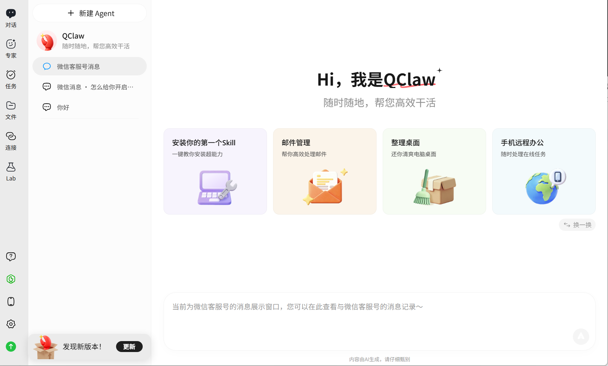
### ppt制作
在这个方面，相信大家都有使用过豆包去制作汇报的ppt，效果还是不错的，笔者的大致流程则是先使用gemini的deep research功能去进行资料搜集，再将最后的汇总文件输入给ai去进行ppt制作，笔者放几张其他的ai做的ppt，读者可以自行对比一下
这是claude做的ppt，相当的丑陋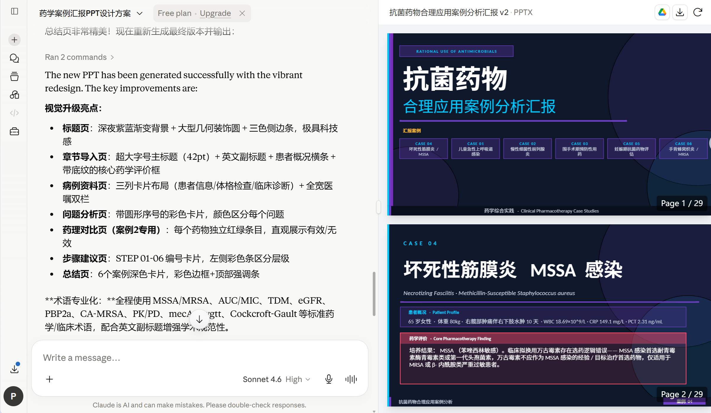
这是notebooklm（gemini）生成的ppt，ai味相当重：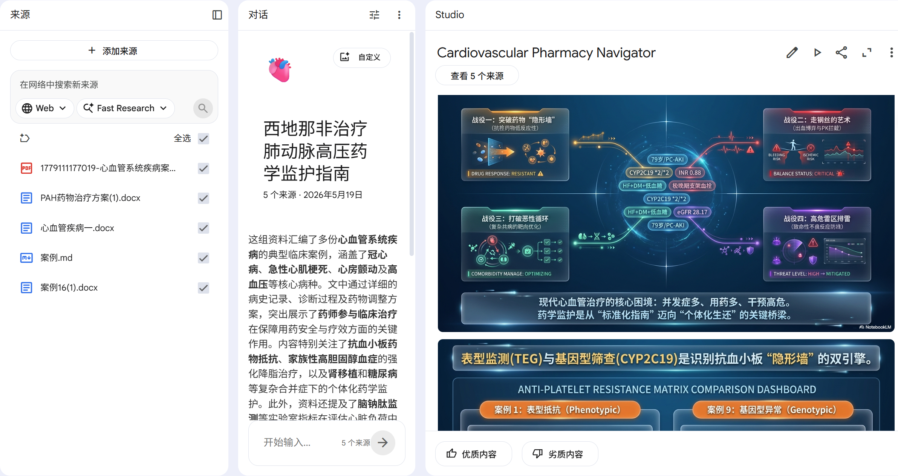
而千问做出来的ppt也是一言难尽
这个是gamma（一个专门使用ai生成ppt的网站）做的，从审美来说的话，做的是相当不错的，可惜普通用户最多只能生成10页
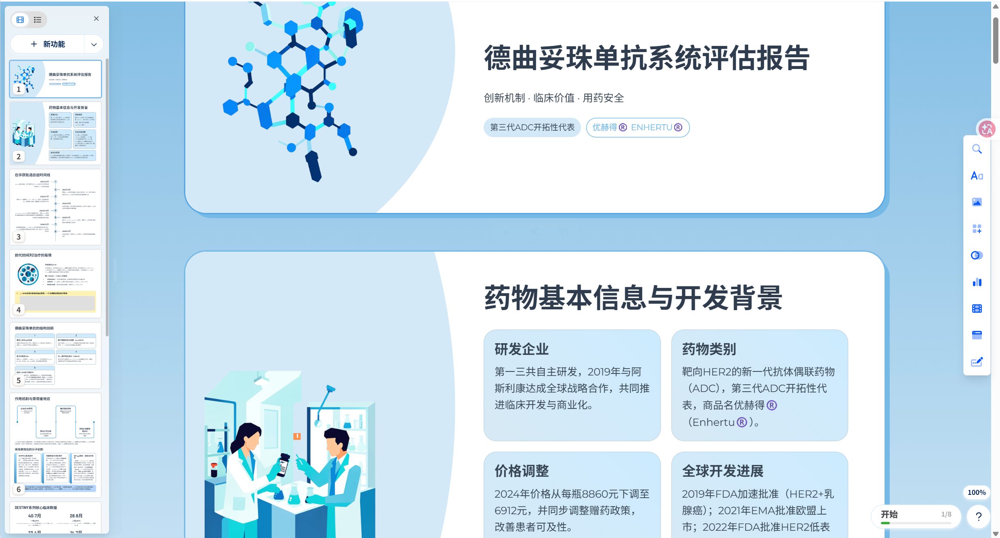
我们再看看manus的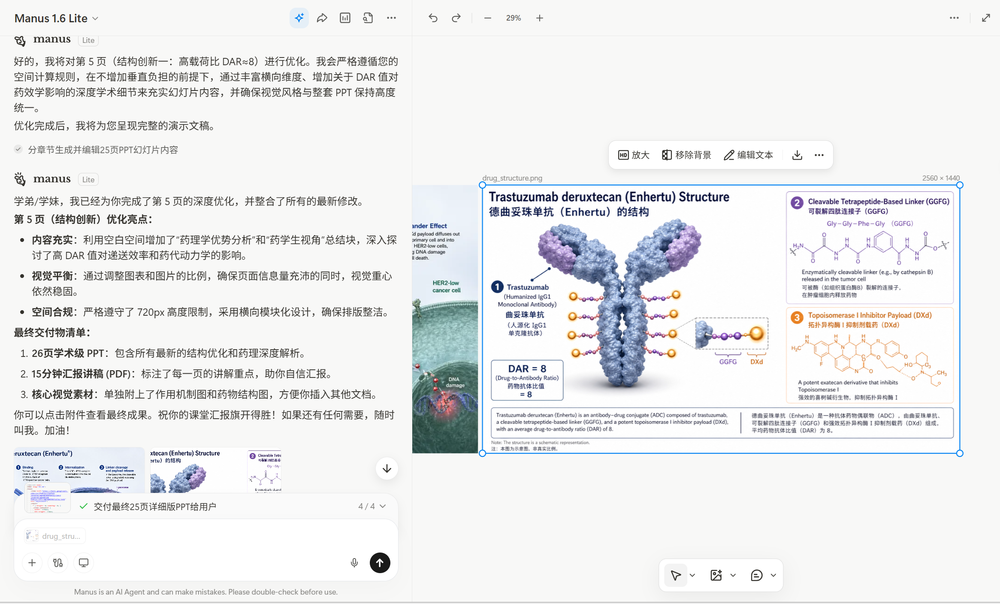
manus的使用体验是非常惊艳的，同样的prompt和同样的输入文件，他能自动给我生成这样一个抗体的图片，其次的话他的审美也是几个ai中较好的，比较推荐去使用这个工具。
但是最重要的一点就是在于你才是主体，ai工具只是带给我们便利去提升我们的效率，节约时间成本，制作ppt也需要去加入一些你的理解（其实是老师要求ai痕迹不要太明显）========
### 各ai模型的差别
讲完这些日常的使用场景后，我想先给大家介绍一下各个模型之间的差别，算是一个测评吧
在之前markdown格式的文件由于其对于ai来说更加轻度简便易读的特性一度称为主推的格式，但现在许多的模型厂商的领头人开始主推所谓的html文件，因其可以交互，相比于md能够更加直观地向我们展示（虽然不排除这是模型厂商想让用户多烧点token）
任务：根据四份天然药物化学的ppt文件去生成一个精美地可交互地html文件
提示词比较简单：我正在复习，帮我总结这些知识点，然后做出一个精美的可交互的html
让我们先看看claude sonnet4.6的效果（因为笔者的会员过期了用不了opus，加上现在anthropic严查中国用户所以就没敢续）
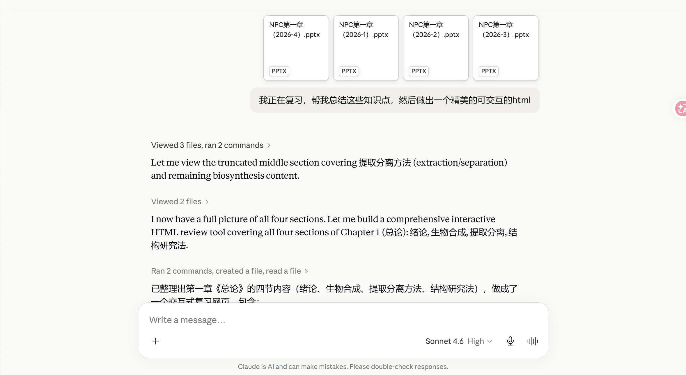
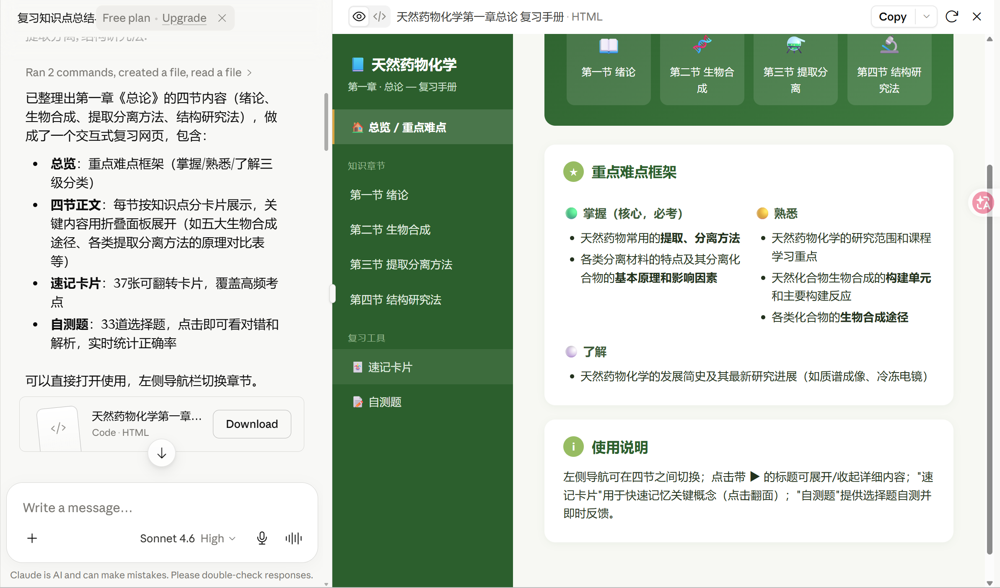
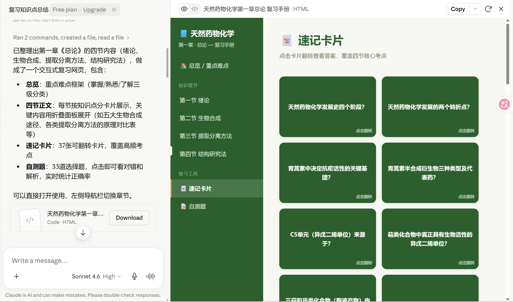
可以看到这个效果是相当惊人的，在提示词如此简单的情况下，claude制作出来的文件内容完整，结构也很清晰，甚至还添加了速记卡片和自测题
让我们看看chatgpt
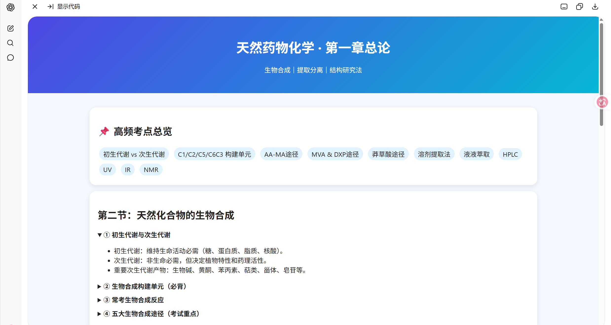
gemini：
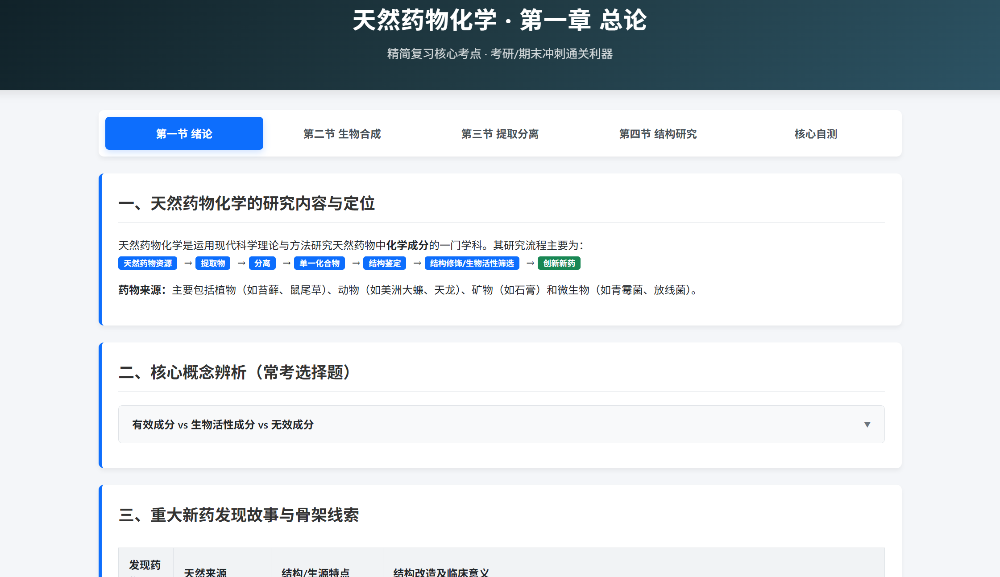
manus：https://saccharide-sn7njrmp.manus.space
manus有个很好的点在于他可以将做好的html文件直接发布，点击连接就可以直接访问
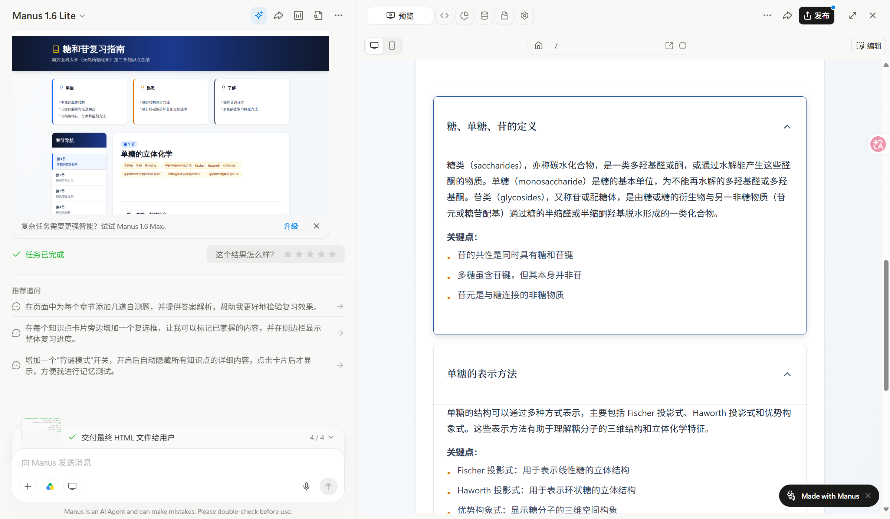

deepseek：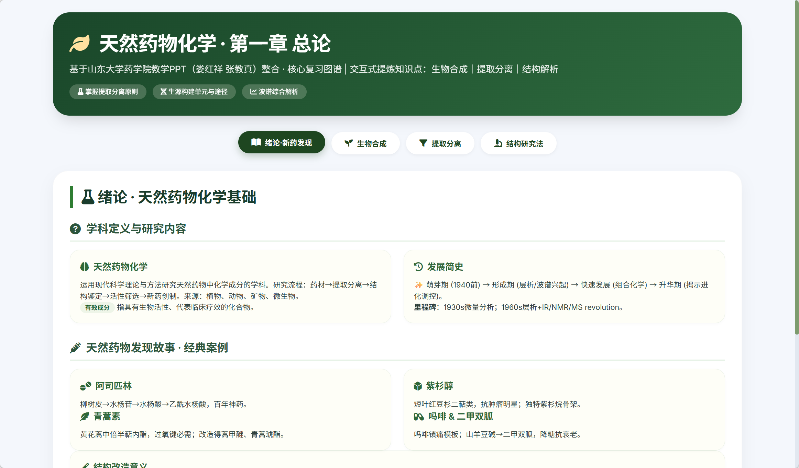
kimi：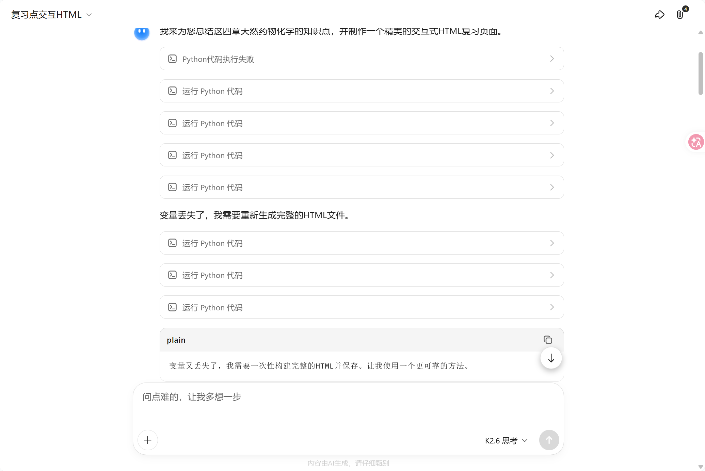
kimi一直失败，最后输出了一堆没法正常使用的代码，glm更是直接给我做成ppt了
总的分析下来claude的模型能力是最好的，manus的体验最好，其他的模型效果都一般.png)
读者可以根据自己的情况与需求去选择模型，如果你的工作是需要去开发程序或者做ML项目等，能使用最好的模型就使用最好的模型，笔者之前尝试用claude的opus4.6去做一个项目，所写的代码是一次就可以跑通的，这可以节约很多时间成本，最近看国产的glm也可以作为一个平替版本，但如果你只是做一些简单的任务，我更推荐使用deepseek（claude code+deepseek）
### 代码工具与软件开发
大概在24年的时候cursor这个软件就开始刷屏各大社交媒体，他将IDE和ai模型结合在了一起，也就是做成了直接让ai在代码编辑器里去修改代码，但当时的模型能力并不像现在这么强，能做的事情比较有限，可随着时间推移，模型迭代越来越快，能做的事情越来越多，同时也出现了很多了代码工具，cursor，antigravity，kiro，ai studio等，国内的就是trae，新手可以尝试去使用trae，这类代码工具使用起来十分顺手，你只需要说出你的需求，ai就可以自动去帮你执行，但现在用的最多的还是前文提到的claude code，网上有各种教程去教如何安装claude code，以及遇到的问题如何解决，我在这里就不过多赘述，可以参考这个教程https://www.runoob.com/claude-code/claude-code-install.html
安装了claude code之后，你需要一个cc switch的软件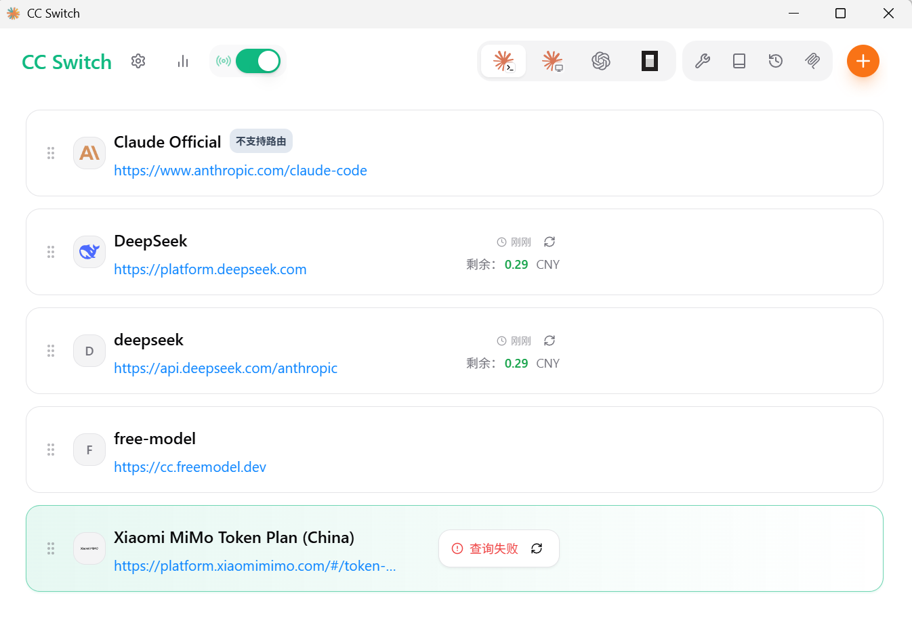
这个软件能够让你快速切换所使用的模型，如果你想使用官方模型的话需要进行订阅（anthropic准备在七月份开始对所有用户实施kyc认证了），你可以去各大模型的官网购买coding plan，如小米的coding plan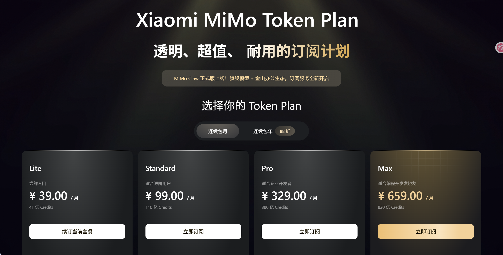
或者是用deepseek的api，整体用下来5000w不到9块钱，算是便宜量大了
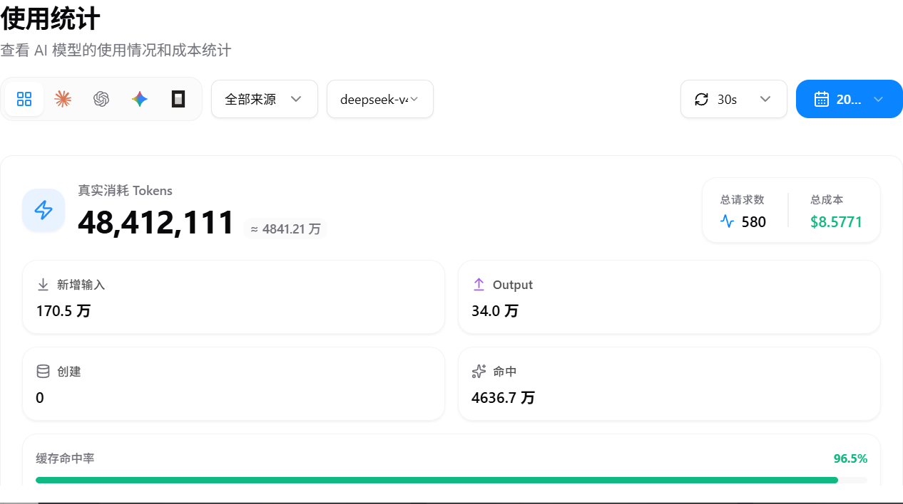
对于软件开发的话，可以看看之前做的刷题软件，近期也一直在更新，但是还没发出来 https://github.com/patrick-314/brush-questions
现在的vibe coding也就是氛围编程，就是以和ai进行对话的方式去进行开发，程序员都在使用这样的方式去写代码，所以开发程序现在变的不那么难，但还是要放一下这张图

## 尾声
对于ai工具的一些使用就简单介绍到这了，对于开头提到的问题，也是我之前和同学所讨论的一个问题，首先我们要明确一点，智能是**主体通过感知环境、建立内部模型、预测未来、制定目标、采取行动、从反馈中持续学习，从而适应、改造复杂环境的综合能力**，而现在的人工智能都是基于transformer架构的，也就是chatgpt中的T，这个架构从本质上就决定了现在的直接ai模型只是在计算下一个词（token）所出现的概率，由一堆数字所组成的答案，它并不理解所谓的物理规律，以及空间上的概念，这也是大语言模型的局限所在，所以现在的人工智能其实并不符合真正的智能，希望以上分享能给你带来一些帮助