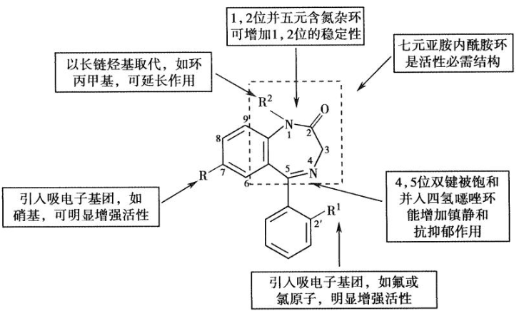
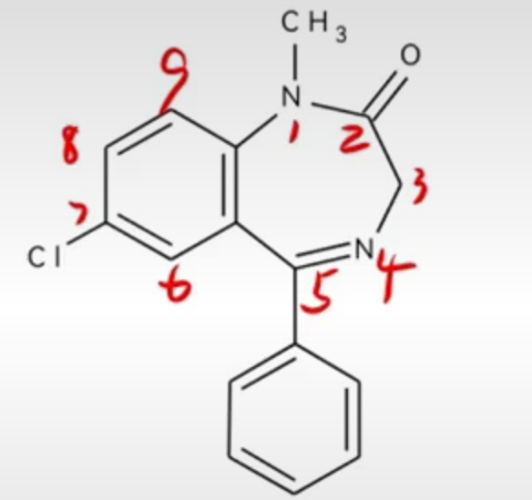
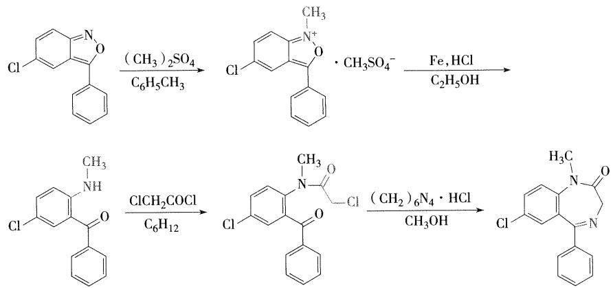
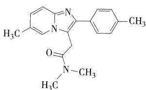
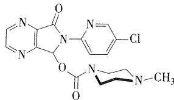

# 中枢神经系统药物
!!! note "各论药物的考研重点"
	1．镇静催眠药、抗癫痫药、抗精神病药、抗抑郁药、镇痛药的分类及代表药 ==【选择题】==
	
	2．苯二氮䓬类药物、巴比妥类药物的理化性质、构效关系 ==【选择题、简答题】==
	
	3．地西泮、苯妥英钠、卡马西平的结构、理化性质、应用、代谢 ==【选择题 / 简答题】==
	
	4．普洛加胺的结构、作为前药的意义 ==【简答题】==
	
	5．吩噻嗪类药物的构效关系 ==【简答题】==
	
	6．氯丙嗪的优势构象、2 位有取代基活性强的原因 ==【简答题】==
	
	7．氯丙嗪、吗啡的结构、命名、理化性质、应用、代谢 ==【选择题 / 简答题】==
	
	8．吗啡类药物的构效关系、共同的结构特征 ==【选择题 / 简答题】==
	
	9．左旋多巴与卡比多巴合用的基础 ==【简答题】==

## 镇静催眠药
分类

- 镇静催眠药 
	 1. 苯二氮䓬类：地西泮、奥沙西泮、硝西泮、三唑仑、艾司唑仑等（西泮+唑仑）
	 2. 非苯二氮䓬类 
		 1. 非苯二氮䓬类GABAₐ受体激动剂：佐匹克隆 
		 2. 巴比妥类 
			- 长时效：巴比妥/苯巴比妥
			- 中时效：异戊巴比妥 
			- 短时效：司可巴比妥 
			- 超短时效：硫喷妥钠 

	 3. 其他类：褪黑素

### 苯二氮卓类
1.结构特征：
具有苯环和七元亚胺内酰胺环合并的苯二氮卓类母核，其中1，4-苯二氮卓类的催眠镇静作用最强，临床上时**镇静催眠、抗焦虑**的首选药物,同时也有抗惊厥作用，在临床上也可以用作抗癫痫药

2.**理化性质**

1，2位的酰胺键和4，5位的亚胺键在酸性条件下容易发生水解开环反应，4，5位开环是可逆反应，当7位和1，2位上有强吸电子基团时，4，5位特别容易重新环合，所以硝西泮、氟硝西泮口服后在胃酸作用下4，5位水解开环，开环化合物进入弱碱性肠道，又闭合形成原药。因此，**4，5位间开环不影响生物利用度**

3.**作用机制与药理作用**
苯二氮卓类药物作用机制与GABA（γ-氨基丁酸）神经递质有关，GABA与受体结合时，会使氯离子通道打开，氯离子内流，神经细胞超极化而产生中枢抑制作用

苯二氮卓类药物占据苯二氮卓受体时，形成苯二氮卓-氯离子通道大分子复合物，==增加氯离子通道开放频率==，增加受体与GABA的亲和力，增加了GABA的作用，从而产生==镇静、催眠、抗焦虑、抗惊厥、中枢性肌松==等药理作用，因此，苯二氮卓被称为GABAa受体激动剂

4.==构效关系==

在苯二氮草类的1,2位，并上五元含氮杂环如咪唑和三唑环，得到后缀为唑仑
在4,5位并入四氢噁唑环，得到的药物命名仍以唑仑为后缀
!!! note "题目"
	1.为什么唑仑类药物比西泮类药物作用强 ==【简答题】==（这种并环结构可以使药物的代谢稳定增加，提高了药物与受体的亲和力，镇静催眠和抗焦虑作用明显增强）
	2.含有三氮唑结构的药物有哪些 ==【选择题】==（三唑仑、溴替唑仑、艾司唑仑、阿普唑仑）

5.药物的体内代谢
主要有去 $N-$ 甲基、C-3位上羟基化、苯环酚羟基化、氮氧化合物还原、1,2位开环等

6.**重点药物**-地西泮

- 地西泮
	- 1.化学名：
		1-甲基-5-苯基-7-氯-1,3-二氢-2H-1,4-苯并二氮杂草-2-酮
	- 2.理化性质：
		水解开环
		加入碘化铋溶液产生橙红色沉淀（生物碱反应）
	- 3.药理作用
		- 与中枢苯二氮卓受体结合发挥安定、镇静催眠、肌肉松弛和抗惊厥作用，临床上主要用于治疗神经官能症
	- 4.体内代谢
		- 主要在肝脏代谢，代谢途径为N-1位去甲基，C-3位的氧化，代谢产物仍有活性。形成的3-羟基化的代谢产物以与葡糖醛酸结合的形式排出体外（替马西泮与奥沙西泮的催眠作用较弱，副作用小，半衰期短，适宜于老年人和肝肾功能不良者使用）
	- 5.地西泮的合成 ==【简答题考点】==
		从3-苯-5-氯苯并 $[\mathrm{c}]$ 异噁唑在甲苯中用硫酸二甲酯在氮上甲基化，再用铁粉在酸性条件下还原，得2-甲氨基-5-氯-二苯甲酮。与氯乙酰氯酰化后，生成2-( $N$ -甲基-氯乙酰氨基)-5-氯二苯甲酮，与盐酸乌洛托品作用，得本品。

### 非苯二氮卓类
- 1.非苯二氮卓类GABAa受体激动剂
	- 咪唑并吡啶类
		 - 代表药物：唑吡坦
			- 主要用于失眠症的短期治疗
			- 选择性作用于苯二氮卓受体的一部分，以增加GABA的传递，调节氯离子通道，表现镇静催眠作用
			- **高度选择性**，选择性和苯二氮卓w1受体亚型结合，对外周苯二氮卓受体亚型无亲和力，而苯二氮卓类药物无此选择性
	- 吡咯烷酮类
		- 代表药物：佐匹克隆（**第三代催眠药**）
			- w1受体亚型选择性激动剂，提高睡眠质量比苯二氮卓类更理想，无成瘾性和耐受性
	- 吡唑并嘧啶类
		- 代表药物：扎来普隆
			- 苯二氮卓w1受体完全激动剂，副作用小，无精神依赖，镇静、抗焦虑、抗惊厥和抗癫痫，还可以用作肌肉、骨骼肌松弛剂
- 2.巴比妥类
	- 结构特征
		- 巴比妥类药物具有共同结构特征，为5，5-二取代基的环丙二酰脲类
	- 作用特点
		- 治疗指数较低，容易产生耐受性和依赖性，且毒副作用多，逐渐被其他药物代替，目前临床主要用于抗惊厥、抗癫痫和麻醉及麻醉前给药
- 3.其他类
	- 内源性促睡眠物质，松果体主要激素是褪黑素