# 中枢神经系统药物
!!! note "各论药物的考研重点"
	1．镇静催眠药、抗癫痫药、抗精神病药、抗抑郁药、镇痛药的分类及代表药 ==【选择题】==
	
	2．苯二氮䓬类药物、巴比妥类药物的理化性质、构效关系 ==【选择题、简答题】==
	
	3．地西泮、苯妥英钠、卡马西平的结构、理化性质、应用、代谢 ==【选择题 / 简答题】==
	
	4．普洛加胺的结构、作为前药的意义 ==【简答题】==
	
	5．吩噻嗪类药物的构效关系 ==【简答题】==
	
	6．氯丙嗪的优势构象、2 位有取代基活性强的原因 ==【简答题】==
	
	7．氯丙嗪、吗啡的结构、命名、理化性质、应用、代谢 ==【选择题 / 简答题】==
	
	8．吗啡类药物的构效关系、共同的结构特征 ==【选择题 / 简答题】==
	
	9．左旋多巴与卡比多巴合用的基础 ==【简答题】==

## 镇静催眠药
分类

- 镇静催眠药 
	1. 苯二氮䓬类：地西泮、奥沙西泮、硝西泮、三唑仑、艾司唑仑等（西泮+唑仑）
	2. 非苯二氮䓬类 
		1. 非苯二氮䓬类GABAₐ受体激动剂：佐匹克隆 
		2. 巴比妥类 
		- (1) 长时效：巴比妥/苯巴比妥
		- (2) 中时效：异戊巴比妥 
		- (3) 短时效：司可巴比妥 
		- (4) 超短时效：硫喷妥钠 
	3. 其他类：褪黑素

### 苯二氮卓类
1.结构特征：
具有苯环和七元亚胺内酰胺环合并的苯二氮卓类母核，其中1，4-苯二氮卓类的催眠镇静作用最强，临床上时 **镇静催眠、抗焦虑** 的首选药物,同时也有抗惊厥作用，在临床上也可以用作抗癫痫药

2.**理化性质**

1，2位的酰胺键和4，5位的亚胺键在酸性条件下容易发生水解开环反应，4，5位开环是可逆反应，当7位和1，2位上有强吸电子基团时，4，5位特别容易重新环合，所以硝西泮、氟硝西泮口服后在胃酸作用下4，5位水解开环，开环化合物进入弱碱性肠道，又闭合形成原药。因此，**4，5位间开环不影响生物利用度**

3.**作用机制与药理作用**
苯二氮卓类药物作用机制与GABA（γ-氨基丁酸）神经递质有关，GABA与受体结合时，会使氯离子通道打开，氯离子内流，神经细胞超极化而产生中枢抑制作用

苯二氮卓类药物占据苯二氮卓受体时，形成苯二氮卓-氯离子通道大分子复合物，==增加氯离子通道开放频率==，增加受体与GABA的亲和力，增加了GABA的作用，从而产生 ==镇静、催眠、抗焦虑、抗惊厥、中枢性肌松== 等药理作用，因此，苯二氮卓被称为GABAa受体激动剂

4.==构效关系==

在苯二氮草类的1,2位，并上五元含氮杂环如咪唑和三唑环，得到后缀为唑仑
在4,5位并入四氢噁唑环，得到的药物命名仍以唑仑为后缀
!!! note "题目"
	1.为什么唑仑类药物比西泮类药物作用强 ==【简答题】==（这种并环结构可以使药物的代谢稳定增加，提高了药物与受体的亲和力，镇静催眠和抗焦虑作用明显增强）
	2.含有三氮唑结构的药物有哪些 ==【选择题】==（三唑仑、溴替唑仑、艾司唑仑、阿普唑仑）

5.药物的体内代谢
主要有去 $N-$ 甲基、C-3位上羟基化、苯环酚羟基化、氮氧化合物还原、1,2位开环等
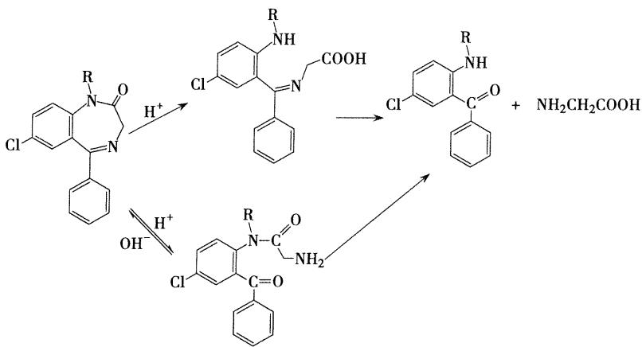
6.**重点药物**-地西泮

- 地西泮
	- 1.化学名：
		1-甲基-5-苯基-7-氯-1,3-二氢-2H-1,4-苯并二氮杂草-2-酮
	- 2.理化性质：
		水解开环
		加入碘化铋溶液产生橙红色沉淀（生物碱反应）
	- 3.药理作用
		- 与中枢苯二氮卓受体结合发挥安定、镇静催眠、肌肉松弛和抗惊厥作用，临床上主要用于治疗神经官能症
	- 4.体内代谢
		- 主要在肝脏代谢，代谢途径为N-1位去甲基，C-3位的氧化，代谢产物仍有活性。形成的3-羟基化的代谢产物以与葡糖醛酸结合的形式排出体外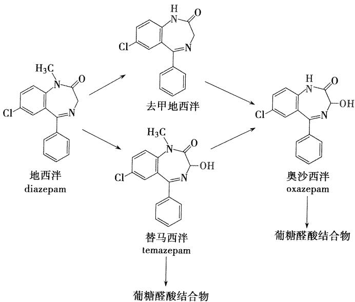
		- （替马西泮与奥沙西泮的催眠作用较弱，副作用小，半衰期短，适宜于老年人和肝肾功能不良者使用）
	- 5.地西泮的合成 ==【简答题考点】==
		从3-苯-5-氯苯并 $[\mathrm{c}]$ 异噁唑在甲苯中用硫酸二甲酯在氮上甲基化，再用铁粉在酸性条件下还原，得2-甲氨基-5-氯-二苯甲酮。与氯乙酰氯酰化后，生成2-( $N$ -甲基-氯乙酰氨基)-5-氯二苯甲酮，与盐酸乌洛托品作用，得本品。

### 非苯二氮卓类
- 1.非苯二氮卓类GABAa受体激动剂
	- 咪唑并吡啶类
		 - 代表药物：唑吡坦
			- 主要用于失眠症的短期治疗
			- 选择性作用于苯二氮卓受体的一部分，以增加GABA的传递，调节氯离子通道，表现镇静催眠作用
			- **高度选择性**，选择性和苯二氮卓w1受体亚型结合，对外周苯二氮卓受体亚型无亲和力，而苯二氮卓类药物无此选择性
	- 吡咯烷酮类
		- 代表药物：佐匹克隆（**第三代催眠药**）
			- w1受体亚型选择性激动剂，提高睡眠质量比苯二氮卓类更理想，无成瘾性和耐受性
	- 吡唑并嘧啶类
		- 代表药物：扎来普隆
			- 苯二氮卓w1受体完全激动剂，副作用小，无精神依赖，镇静、抗焦虑、抗惊厥和抗癫痫，还可以用作肌肉、骨骼肌松弛剂
- 2.巴比妥类
	- 结构特征
		- 巴比妥类药物具有共同结构特征，为5，5-二取代基的环丙二酰脲类
	- 作用特点
		- 治疗指数较低，容易产生耐受性和依赖性，且毒副作用多，逐渐被其他药物代替，目前临床主要用于抗惊厥、抗癫痫和麻醉及麻醉前给药
- 3.其他类
	- 内源性促睡眠物质，松果体主要激素是褪黑素

## 抗癫痫药
1. 发病机制：大脑局部神经元兴奋性过高，反复发生阵发性放电而引起的脑功能异常
2. 抗癫痫药作用：
	 防止或减轻中枢病灶神经元的过度放电
	 提高正常脑组织的兴奋阈从而减弱来自病灶的兴奋扩散
	 通过调节GABA系统，预防和控制癫痫发作
### 酰脲类
- 1. 巴比妥类
	- 结构特征：5，5-二取代的环丙二酰脲
	- 分类与代表药物：
		- 长效（4-12小时）：苯巴比妥
		- 中效（2-8小时）：异戊巴比妥
		- 短效（1-4小时）：司可巴比妥
		- 超短效（0.5-1小时）：硫喷妥钠
	- 理化性质：
		- 酸性：
			- 5,5-二取代基的巴比妥类药物具有内酰胺-内酰亚胺互变异构，形成烯醇型呈现**弱酸性**，可溶于氢氧化钠和碳酸钠溶液中，生成钠盐，==在碳酸氢钠中不溶==。巴比妥酸的酸性（ $\mathrm{pK}_{\mathrm{a}} = 4.12$ ）弱于碳酸，其钠盐不稳定，容易吸收空气中的二氧化碳 ==而析出巴比妥类沉淀==。 ==【选择题考点】==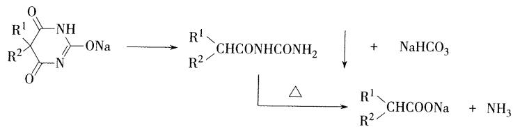
		- 水解性：
			- 互变异构分子双内酰亚胺结构，比酰胺更易水解，因而巴比妥类药物 ==易发生水解开环反应==。
	- 作用机制：
		- 延长氯离子通道的 ==开放时间==，延长GABA的作用 ==（苯二氮卓类则是增加开放频率）==
	- 临床应用
		- 镇静催眠、抗惊厥、抗癫痫（ ==大发作和局限性发作==）、麻醉前给药（安全性窄）
	- 构效关系
		- **5位的取代基碳原子数之和为4时出现镇静催眠作用，碳原子数之和为7~8时，作用最强，但碳原子数之和超过10时，亲脂性过强，会产生惊厥作用**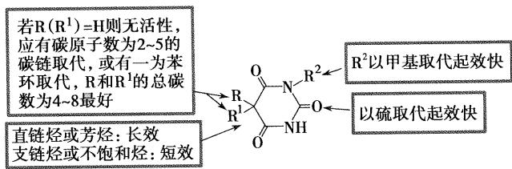
		- ==【简答题】==：巴比妥类药物作用时间长短与什么有关
			- 取代基类型不同，起效快慢和作用时间也不同，作用时间长短与5，5位的双取代基在体内代谢过程有关，饱和烷烃和苯基在体内不易代谢，作用时间长，如苯巴比妥
			- 与药物解离常数PKa和脂溶性有关，如，2位碳上的氧原子换成硫原子，脂溶性增加，起效快，作用时间短，硫喷妥钠
- 乙内酰脲类
	- 乙内酰脲化学结构中的一NH一以其电子等排体— $\mathrm{CH}_2$ 一替换, 则得到丁二酰亚胺类，乙琥胺(ethosuximide)对癫痫大发作效果均不佳, 常用于小发作和其他类型的发作。==是失神性发作的首选药物==
	- 代表药物：苯妥英钠
		- 化学名：5，5-二苯基乙内酰脲钠盐，又名大伦丁钠
		- 结构特点：环状酰脲
	- 理化性质
		- 微有引湿性，吸收二氧化碳，析出白色苯妥英
		- 水溶液显碱性反应，常因水解而发生浑浊，需密闭保存
		- 水解性：与碱加热可以分解产生二苯基脲基乙酸，最后生成二苯基氨基乙酸，并释放出氨。
	- 临床应用：
		- 抗惊厥作用强，虽然毒性较大，并有致畸的副作用，但 ==仍是治疗癫痫大发作和局限性发作的首选药==
	- 合成：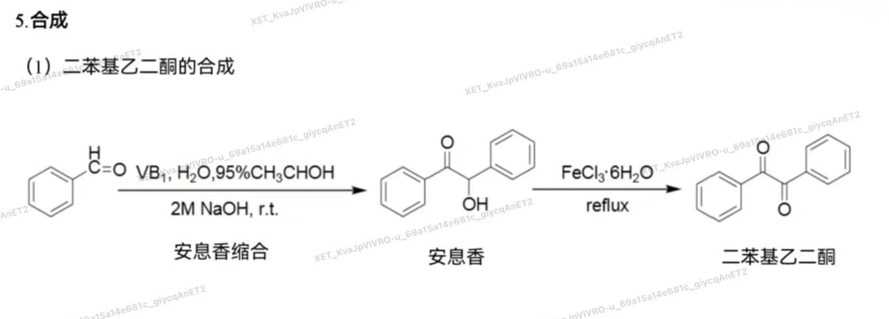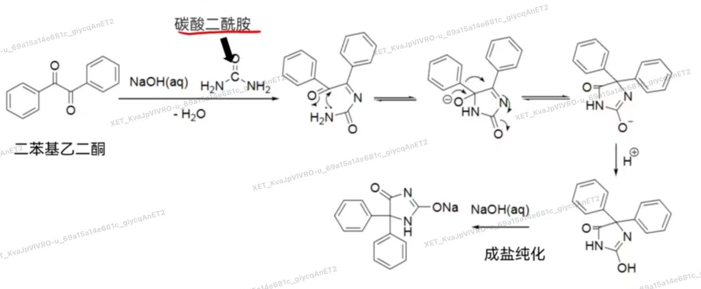
	- 
	- ==苯妥英钠与巴比妥药物的区别==
		- 苯妥英钠水溶液加入二氯化汞后可生成白色沉淀，在氨试液中不溶
		- 巴比妥类药物虽也有汞盐反应，但所得沉淀溶于氨试液中
### 二苯并氮杂卓类
- 卡马西平：
	- 化学名：5H-二苯并[b,f]氮杂草-5-甲酰胺,==简称CBZ==
	- 结构特点：两个苯环与氮杂卓环并合而成
	- 理化性质：
		- 在干燥和室温下比较稳定
		- 片剂在潮湿环境中保存时药效降低至原来的三分之一，**原因可能是生成本品的二水合物，使片剂表面硬化，导致本品的溶解和吸收困难**
		- 长时间光照，固体表面由白色变橙色，部分生成二聚体和10,11-环氧化物，故需避光保存。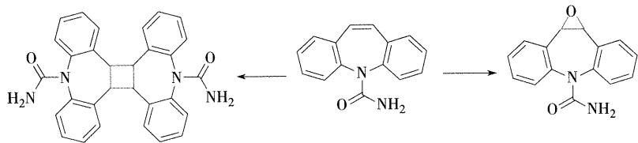
	- 合成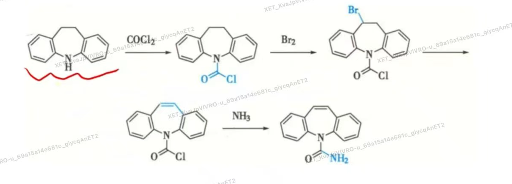
	- 肝脏代谢
		- 在肝脏代谢，主要产物为10，11-环氧卡马西平，仍具有抗癫痫活性
	- 临床应用
		- 治疗癫痫大发作和综合性局灶发作，对失神发作无效

- 奥卡西平：
	- 为前体药物，在胃肠道内几乎完全吸收，奥卡西平耐受性比卡马西平好，具有不良反应低、毒性小的优点

### GABA类似物
- 1.普洛加胺
	- 化学名：4-[[（4-氯苯基)-（5-氟-2-羟基苯基)甲亚基]氨基]丁酰胺，又名“卤加比“
	- 作用靶点：GABA受体激动剂，直接激动GABA受体
	- 卤加比作为前药的意义  ==【简答题】== 
		- 卤加比是一种拟GABA药，是γ-氨基丁酰胺的前药，二苯甲亚基为载体部分与γ-氨基丁酰胺相连，==制成前药可使药物亲脂性增加，便于药物透过血脑屏障在中枢神经发挥癫痫作用==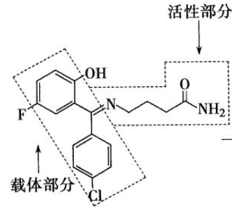

### 脂肪酸类
- 代表药物：丙戊酸钠
	- 临床应用：广谱抗癫痫药，主要适用于单纯或复杂失神发作、全身强直-阵挛发作、肌阵挛发作的治疗，对各型小发作的效果更好，为镇静作用小的代表药物

## 抗精神病药
作用机制：
	精神分裂症可能与患者脑内多巴胺过多有关，经典的抗精神病药物是DA受体阻断剂，能阻断中脑-边缘系统及中脑-皮质通路的DA受体，减低DA功能，发挥抗精神病作用

- 1.吩噻嗪类抗精神病药
	- 如何由异丙嗪经结构改造得到氯丙嗪 ==【简答题】==
		- 异丙嗪吩噻嗪环与侧链氨基间的碳原子数增至3时，抗组胺作用减弱而安定作用增强，在环上再引入氧原子，可能由于脂溶性增加，更易于透过血脑屏障，抗精神病作用增强，得到抗精神病药物氯丙嗪
	- 构效关系 ==【简答题】==
		- 5位的硫为非必须基团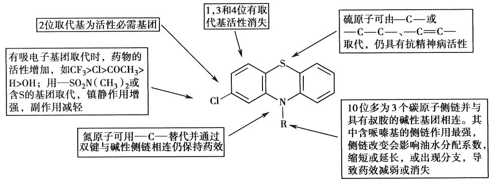
	- 吩噻嗪类药物与受体的作用方式 ==（氯丙嗪的氯原子去掉之后为什么失去了抗精神病活性）==
		- 氯丙嗪的优势构象**顺式构象**中，**侧链倾斜于有氯取代的苯环方向**，这种优势构象可与多巴胺的优势构象部分重叠，有利于与多巴胺受体的作用，优势构象中侧链倾斜于含氯原子的苯环是该类药物分子抗精神病作用的重要结构特征，**失去氯原子则无抗精神病作用**，这也是吩噻嗪类药物2位有取代基时活性强的原因
	- 代表药物：盐酸氯丙嗪(冬眠灵)
		- 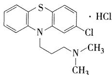
		- 理化性质 ==【选择题考点】==
			- 母核易被氧化
				- 环中的S和N都是良好的电子给予体，易被氧化
				- 在空气中放置，渐变为红棕色
				- 日光及重金属离子对氧化有催化作用，遇氧化剂则被迅速氧化破坏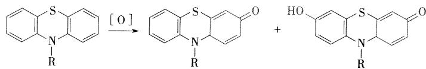
			- 遇光分解
				- 遇光分解成自由基，自由基与体内一些蛋白质作用时，发生过敏反应
				- 口服或者注射吩噻嗪类药物后，部分患者在日光强烈照射下会发生严重的 ==光化毒过敏反应==，皮肤出现红疹 ==【选择题考点】==
			- 氧化变质
				- 注射液在日光作用下引起的氧化变质反应，可使注射液ph降低，为防止变色，在生产中可加入对氢醌，连二亚硫酸钠、亚硫酸氢钠或**维生素C等抗氧化剂**==【选择题考点】==
			- 显色反应
				- 水溶液中加硝酸后可能形成自由基或醌式结构而显红色（吩噻嗪类药物共有的反应）
				- 与三氯化铁试液反应，显稳定的红色
		- 体内代谢
			-  N-氧化、硫原子氧化，苯环的羟基化，侧链脱 N-甲基和侧链的氧化等，氧化产物和葡糖醛酸结合通过肾脏排出。
			- 氯丙嗪5位 $S$ 经氧化后生成亚砜，进一步氧化成砜，两者均为无活性的代谢产物。苯环的氧化以7-羟氯丙嗪活性代谢物为主，羟基氧化物可进一步在体内烷基化，生成相应的甲氧基氯丙嗪。侧链脱 $N-$ 甲基可生成单脱甲基氯丙嗪及双脱甲基氯丙嗪，这两种代谢产物在体内均可与多巴胺 $\mathrm{D}_2$ 受体作用，均为活性代谢物。
		- 临床应用
			- 与多巴胺受体结合，阻断神经递质多巴胺与受体的结合从而发挥作用，本品还可与中枢胆碱受体、肾上腺素受体、组胺受体和5-羟色胺受体结合，产生一定的抑制作用，临床上常用于治疗精神分裂症和躁狂症，大剂量时可应用于镇吐、强化麻醉及人工冬眠（可以降低体温）    冬眠合剂：异丙嗪、氯丙嗪、哌替啶
		- 不良反应
			- 主要副作用有口干，上腹部不适、乏力、嗜睡、便秘等，具有严重的 ==锥体外系反应==（帕金森综合征），对产生光化毒反应的患者，在服药期间尽量减少户外活动，避免日光照射
		- 合成路线
			- 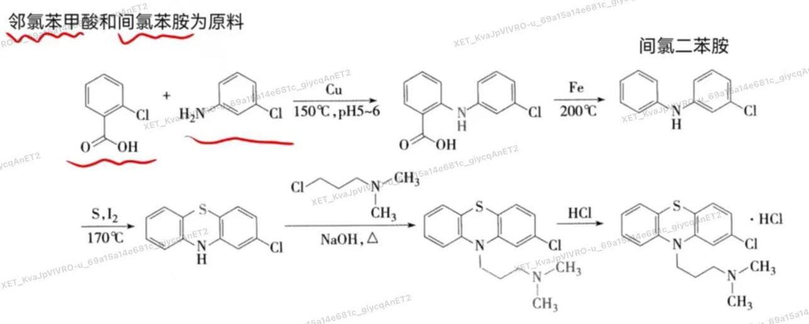
		- 结构改造
			- 氟奋乃静的前药：氟奋乃静庚酸酯或癸酸酯，肌注可延长作用时间，适用于长期用药及依从性不好的精神分裂症患者
- 噻吨类
	- 噻吨类的基本结构与吩噻嗪类相似，根据 **生物电子等排原理，用碳原子替换吩噻嗪母核中的10位氮原子，并通过双键与碱性侧链相连** ，则形成噻吨类抗精神病药，亦称“硫杂蒽类抗精神病药”==【名词解释】==
	- 代表药物：氯普噻吨
- 丁酰苯类
	- 将镇痛药哌替啶的 $N\cdot$ 甲基用丙酰苯基取代时，不仅具有一定的镇痛作用，而且有很强的抗精神失常作用。将丙基的碳链延长为丁基，可使吗啡样的成瘾性消失，由此发展了有较强抗精神失常作用的丁酰苯类，较吩噻嗪类药物抗精神病作用强，同时还可作为抗焦虑药。
	- 代表药物：氟哌啶醇
		- 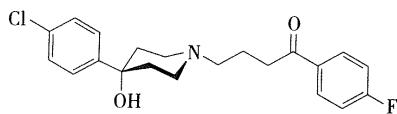
		- 理化性质
			- 如处方中有乳糖，氟哌啶醇会与乳糖中的杂质5-羟甲基-2-糠醛发生加成反应，影响片剂的稳定性，片剂处方应避免使用乳糖
		- 临床应用
			- 用于治疗各种慢性精神分裂症合躁狂症
		- 副作用：
			- 锥体外系反应
			- 致畸反应
- 二苯并二氮卓类及其衍生物
	- 对吩噻嗪类的噻嗪环进行结构改造，将六元环扩为二苯并二氮草环得到非典型的广谱抗精神病药氯氮平特异性地作用于中脑皮质的多巴胺神经元，具有较好的抗精神病作用
	- 氯氮平
		- 临床应用
			- 抗精神病药，治疗难治性精神分裂症
		- 不良反应
			- 锥体外系反应轻
			- 毒副作用主要由代谢产物引起。在人的肝微粒体、中性粒细胞或骨髓细胞中能产生硫醚的代谢物，导致毒性。故本品在使用时要监测白细胞的数量
- 苯甲酰胺衍生物类
	- 甲氧氯普胺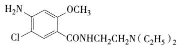，具有中枢多巴胺拮抗作用，在此基础上，合成了以舒必利为代表的苯甲酰胺类抗精神病药。该类药物可选择性地阻断多巴胺受体，具有作用强且副作用小的优点，可用于精神分裂症和顽固性呕吐的对症治疗。
## 抗抑郁药
发病机制：情感性精神障碍的病因复杂，中枢特定的神经递质去甲肾上腺素和/或5-羟色胺的含量降低及其受体功能低下，被认为是引起抑郁的原因，通过调节脑内NE及5-HT的含量，可以达到治疗效果

- 1.单胺氧化酶（MAO）抑制剂
	- 作用机制
		- 是一种催化体内单胺类递质代谢失活的酶，单胺氧化酶抑制剂可以通过抑制NE、肾上腺素、5-HT等的代谢失活，减少脑内5-HT和NE的氧化脱胺代谢，使脑内受体部位神经递质5-HT或NE的浓度增加，利于突触的神经传递而达到抗抑郁的效果
	- 代表药物
		- 吗氯贝胺 ==（结构需要会画）== 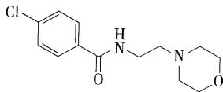
			- 苯甲酰胺的衍生物，为特异性MAO-A的可逆性抑制剂，临床上适用于内源性抑郁症、轻度慢性抑郁症、精神性或反应性抑郁症的长期治疗、提高情绪、改善抑郁症状
		- 托洛沙酮
- 2.去甲肾上腺素再摄取抑制剂
	- 作用机制
		- 神经突触对NE的重摄取，可降低脑内NE的含量，表现为抑郁。去甲肾上腺素重摄取抑制剂通过抑制神经突触前端NE的重摄取，从而起到抗抑郁的作用。该类药物多为三环类化合物，或称 ==三环类抗抑郁药（TCAs）==
	- 代表药物
		- 盐酸丙米嗪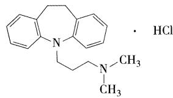
			- 较强的抗抑郁作用，适用于治疗内源性抑郁症，反应性抑郁症及更年期抑郁症，也可用于小儿遗尿症
		- 地昔帕明
			- 丙咪嗪在肝脏代谢，大部分生成活性代谢物地昔帕明（ **去甲丙米嗪** ，desipramine），丙米嗪和地昔帕明可进一步氧化代谢生成2-羟基代谢物而失活，并与葡糖醛酸结合，经尿排出体外
		- 阿米替林
			- 采用生物电子等排体原理，将二苯并氮杂草母核中的氮原子以碳原子取代，并通过双键与侧链相连，便形成 **二苯并环庚二烯类** 抗抑郁药，可选择性地抑制中枢突触部位对NE的再摄取，在三环类抗抑郁药中镇静效应最强，对抑郁患者可使情绪明显改善
- 3.选择性5-羟色胺重摄取抑制剂
	- 作用机制
		- 5-羟色胺重摄取抑制剂的作用是抑制神经细胞对5-HT的重摄取，提高其再突触间隙中的浓度，从而起到抗抑郁的作用
	- 代表药物
		- 氟西汀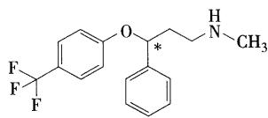
			- 为非三环类的抗抑郁药，临床上常用其盐酸盐， $S$ 异构体的活性较强，临床使用外消旋体。通过拆分可降低毒性和副作用，安全性更高
			- 口服吸收好，生物利用度可达 $100\%$ ，半衰期长达70小时，是长效的口服抗抑
			- 胃肠道吸收，在肝脏代谢成活性的 $N-$ 去甲基代谢物去甲氟西汀（demethyl fluoxetine），通过肾脏消除
			- 去甲氟西汀与原药活性相同，且半衰期长，有产生药物积蓄及排泄缓慢的现象
		- 其他的代表药物：帕罗西汀、舍曲林、文拉法辛、度洛西汀、维拉佐酮
- 4. 5-HT、NE双重摄取抑制剂
	- 代表药物
		- 文拉法辛、度洛西汀
- 5. 特异性NE/5-HT能抗抑郁药（NaSSA)
	- 代表药物
		- 米氮平
- 抗抑郁药的分类及举例 ==【简答题-南方医科大学2025年】==

## 镇痛药
1.疼痛的定义：对于组织损伤或者潜在组织损伤而产生的不愉快的主观感觉和体验

2.麻醉性镇痛药（阿片类镇痛药/中枢性镇痛药）：作用于中枢神经系统的阿片受体，选择性地抑制痛觉但不影响意识，也不干扰神经冲动传到地药物

3.药理作用：具有较强地镇痛作用

4.副作用：成瘾性、耐受性及呼吸抑制

5.分类：镇痛药根据其与阿片受体相互作用的关系，可分为阿片受体激动剂、阿片受体部分激动剂。按结构和来源，又可分作吗啡生物碱、半合成和全合成的镇痛药三大类。

- 吗啡及其衍生物
	- 代表药物：吗啡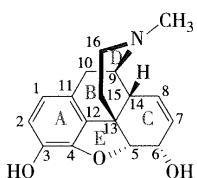
		- 来源：
			- 从罂粟未成熟果实的乳汁中提取
		- 结构特点：
			- 由五个环（A、B、C、D、E）稠合而成的复杂结构，含有部分氢化的菲环，每个环上有固定的编号
		- 光学性质：
			- 环上有五个手性碳原子（5R、6S、9R、13S和14R）
			- 天然存在的吗啡为 ==左旋吗啡== ，为 $\mu$ 受体激动剂
			- B/C环呈顺式，**C/D环呈反式** ，C/E环呈顺式
		- 理化性质 ==【选择题考点】==
			- 酸碱两性：
				- 吗啡为 ==两性化合物==，3位的酚羟基呈弱酸性，17位叔胺氮原子呈碱性
				- 碱性：叔胺氮原子呈碱性，我国法定用吗啡的盐酸盐
				- 酸性：3位的酚羟基呈弱酸性，可与氢氧化钠及氢氧化钙溶液成盐，成盐后可溶解，不与氢氧化铵成盐
			- 还原性：
				- 光照下可被氧化，生成伪吗啡和N-氧化吗啡，可以加入抗氧化剂等
			- 旋光性：
				- 天然存在的吗啡为左旋体，右旋体已被合成，但无镇痛活性
			- 脱水及重排：
				- 吗啡在酸性溶液中加热，可脱水并进行分子重排，生成具有邻苯二酚结构的 ==阿扑吗啡== ，阿扑吗啡为多巴胺受体的激动剂，可兴奋中枢的呕吐中心，临床上用作 ==催吐剂== ，可用稀硝酸氧化成邻苯二醌而显红色，用作鉴别
		- 药动学特点
			- 吸收：
				- 口服后，在胃肠道易吸收，但肝脏的首过效应显著，生物利用度低，故常用皮下注射
			- 代谢： 
				- $10\%$ 脱 $N-$ 甲基为去甲基吗啡，去甲基吗啡的活性低、毒性大
			- 排泄：
				-  $20\%$ 以游离的形式自肾脏排出
		- 临床应用
			- 产生镇痛、镇咳、镇静作用。临床上主要用于抑制剧烈疼痛，亦用于麻醉前给药
		- 作用机制
			- 激动脊髓胶质区、丘脑内侧、脑室及导水管周围灰质的阿片受体
- 吗啡的半合成衍生物
	- 3位、6位结构改造
		- 3位酚羟基烷基化通常导致镇痛活性降低，成瘾性降低，吗啡3位酚羟基是重要的活性基团，  ==可待因为镇痛药和镇咳药==，适用于中度疼痛，作为中枢麻醉性镇咳药，是临床上最有效的镇咳药之一，有轻度成瘾性（用于无痰干咳），可以代谢成吗啡
		- 3、6位两个羟基乙酰化后得到的二乙酸酯称为 ==海洛因==，镇痛及麻醉作用均强于吗啡，毒性和成瘾性更大
	- 2、6位氧化，7、8位还原结构改造
		- 7-8位间双键氢化还原，6位醇羟基氧化成酮，得到氢吗啡酮，镇痛活性是吗啡的8-10倍
		- 将氢吗啡酮三位羟基甲基化得到氢可酮，镇痛作用弱于吗啡
	- 17位结构改造
		- 羟吗啡酮17位N-甲基换成 **烯丙基或环丙甲基**，分别得到 **纳洛酮、纳曲酮** ，结构变化导致吗啡对受体的活性作用发生逆转，由激动剂转化为拮抗剂，纳洛酮也可作为 ==吗啡类药物中毒的解毒剂== ==【选择题考点】==
		- 纳曲酮的拮抗效果是纳洛酮的2-3倍，作用时间也长，是专一性的u受体拮抗剂
	- 6，14桥和7位取代结构改造
		- 在C环的6位和14位之间引入一桥链乙烯基，形成一个新稠环，得到镇痛活性百倍增高的高效镇痛药埃托啡，镇痛效力为吗啡的2000-10000倍，治疗指数低，副作用大
		- 将埃托啡桥乙烯基氢化得二氢埃托啡，镇痛作用更强，副作用小，可用于缓解癌症疼痛
- 合成镇痛药
	- 吗啡喃类： ==吗啡分子去除E环后的衍生物==
		- 左啡诺
	- 苯并吗喃类
		- 喷他佐辛
			- 对u受体有微弱得拮抗作用，是阿片受体部分激动剂，作用于K受体，大剂量时有轻度拮抗吗啡的作用，镇痛效力为吗啡的三分之一，但副作用少，成瘾性小，是第一个用于临床的非成瘾性阿片类合成镇痛药
	- 哌啶类（代表药物：哌替啶）
		- 4-苯基哌啶类
			- 哌替啶（杜冷丁）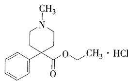
				- 酸催化下易水解，ph=4时最稳定
				- 存在两种构象，一种为苯环处于直立键，另一种为苯环处于平伏键 ==（9版教材写直立键为哌替啶镇痛的活性构象，8版教材则为平伏键）==
				- 代谢：在肝脏代谢，主要代谢物为哌替啶酸、去甲哌替啶、去甲哌替啶酸，并与葡萄糖醛酸结合经肾脏排泄，其中去甲哌替啶镇痛活性仅为哌替啶的一半，而惊厥作用比较大
				- 临床应用：阿片u受体激动剂，镇痛效果是吗啡的1/8-1/6，成瘾性弱，起效快，作用时间短
		- 4-苯氨基哌啶类
			- 芬太尼
				- u受体激动剂，镇痛效果是哌替啶的倍，吗啡的倍
	- 氨基酮类 ==（氨基酮类美沙酮，脱瘾疗法它最行）==
		- 美沙酮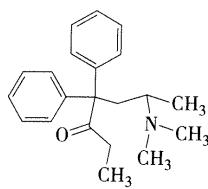
			- 具有旋光性，左旋体镇痛活性大于右旋体，药用外消旋体
			- 临床应用
				- u受体激动剂，镇痛作用比吗啡、哌替啶强，用于各种剧痛
				- 成瘾性小，用于海洛因成瘾治疗
	- 其他类
		- 氨基四氢萘衍生物
			- 地佐辛
		- 4-苯基哌啶类似物
			- 曲马多

阿片样镇痛药的构效关系
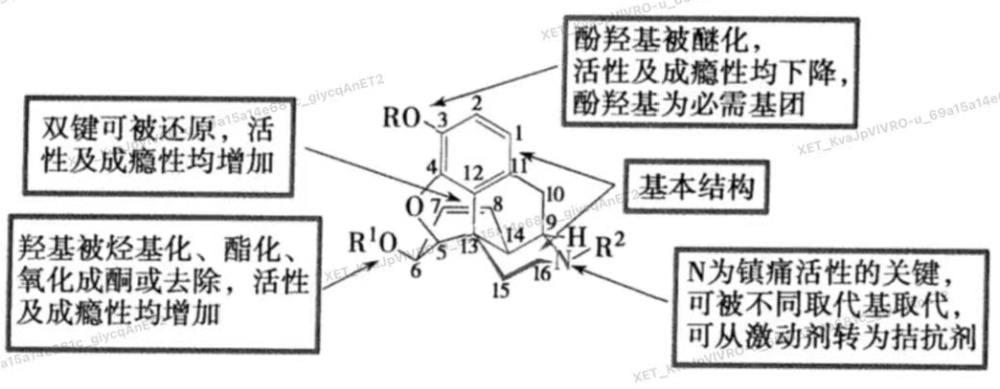
A/D环是基本结构

!!! note "镇痛药的共同结构特征"
	1.分子中具有一个平坦的芳环结构
	
	2.有一个叔氮原子碱性中心，能在生理ph条件下大部分电离为阳离子，碱性中心和平坦结构在同一个平面
	
	3.含有哌啶或类似哌啶的空间结构，而哌啶或类似哌啶的烃基部分，应突出于由芳环构成的平面上方

## 神经退行性疾病治疗药物
### 抗帕金森病药
- 拟多巴胺药
	- 代表药物：左旋多巴
		- 理化性质：
			- 具有邻苯二酚结构，极易被氧化变色，高温、光、碱和金属离子可加速其变化，因此常在注射剂中加入L-半胱氨酸盐酸盐作为抗氧化剂，变黄则不能供临床使用
		- 光学性质
			- 有手性中心，临床用L-左旋体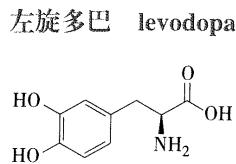
		- 吸收
			- 本品口服后95%以上被外周组织的脱羧酶转化为DA，不能透过血脑屏障发挥作用，从而产生许多不良反应， ==临床上常与外周脱羧酶抑制剂合用，可减少左旋多巴在外周的代谢，使进入脑内的药量显著增加，外周不良反应减少==
		- 临床应用：
			- 用于治疗各种类型的帕金森综合征
		- 不良反应
			- 安全范围小，口服经小肠迅速吸收广泛分布于体内各组织，仅有 $1\% \sim 3\%$ 的原型药物能通过血脑屏障进入中枢转化为DA而发挥作用，外周不良反应多，主要有恶心、呕吐、食欲减退等胃肠道反应，激动、焦虑、躁狂等精神行为异常，直立性低血压，不自主运动，“开-关”现象
		-  ==【高频简答题：左旋多巴和卡比多巴合用的基础/原因】==
			- 外周脱羧酶抑制剂不易进入中枢，可抑制外周多巴胺脱羧酶，阻止左旋多巴在外周降解，使循环中的左旋多巴的量增加5~10倍，促使DA进入中枢神经系统而发挥作用。与左旋多巴合用，既可减少左旋多巴的用量，又可降低左旋多巴对心血管系统的不良反应
- 外周脱羧酶抑制剂	
	- 临床上常用的外周脱羧酶抑制剂有 ==卡比多巴和苄丝肼==，与左旋多巴制成复方制剂合用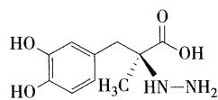
	-  左旋多巴与卡比多巴组成的复方制剂称为：卡左双多巴
- 多巴胺受体激动剂
	- 麦角类
		- 溴隐亭
	- 非麦角类
		- 罗匹尼罗
			- 本品口服吸收迅速而完全，首过效应非常显著，生物利用度约为 $50\%$ 。吸收后可迅速分布到组织中，还可迅速通过血脑屏障。本品耐受性良好，大多数不良反应与它的外周DA活性有关
- 多巴胺加强剂
	- DA的体内代谢主要通过单胺氧化酶（MAO），多巴胺-β-羟基化酶（DBH）和儿茶酚-O-甲基转移酶（COMT）进行。这三种酶的抑制剂都能够降低脑内DA的代谢，从而提高脑内DA水平，称为多巴胺加强剂或多巴胺保留剂，对帕金森病有治疗作用，目前临床使用的主要是单胺氧化酶抑制剂（MAOI）和儿茶酚-O-甲基转移酶抑制剂
- 帕金森病是中枢的DA和乙酰胆碱平衡被打破所致，一些合成的中枢性抗胆碱药物、某些抗抑郁药也可作为抗帕金森病的辅助治疗药物，还有其他一些药物也在临床上应用。
	- 例如：苯海索、阿米替林

### 阿尔兹海默症（AD）
一种年龄高度相关，以进行性认知功能障碍和记忆力损害为主的中枢神经系统退行性疾病

- 乙酰胆碱酯酶抑制剂
	- 代表药物：多奈哌齐
	- 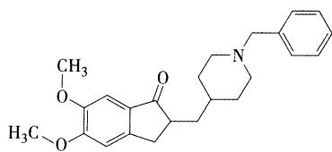
	- 同类药物：他克林、石衫碱甲、加兰他敏
- 其他阿尔茨海默症
	- 美金刚、吡拉西坦、维生素E